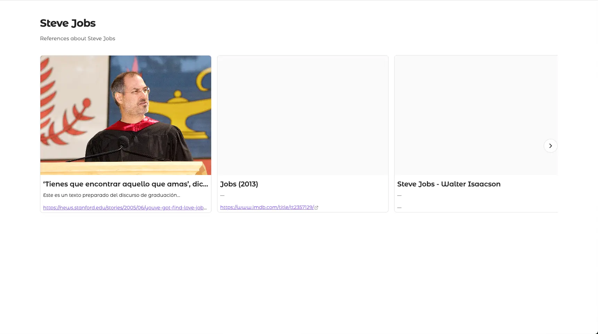

# Lovely Bases

Beautiful, visual bases views for Obsidian. Transform your Obsidian Bases into stunning, interactive visual experiences with smooth animations and intuitive navigation.

## ✨ Features

- **Multiple Base Views**: Choose from a variety of beautiful, customizable views for your Obsidian Bases
- **Smooth Animations**: Powered by Motion (formerly Framer Motion) for fluid, performant animations
- **Obsidian Theme Integration**: Automatically adapts to your Obsidian theme colors
- **Responsive Design**: Optimized for both desktop and mobile devices
- **Customizable**: Each view offers configuration options to suit your needs

## 📦 Installation

### From Obsidian

> **Note**: This plugin is not yet registered in the Obsidian Community Plugins repository. Please use BRAT or manual installation methods below.

1. Open Obsidian Settings
2. Go to **Community plugins**
3. Click **Browse** and search for "Lovely Bases"
4. Click **Install**
5. Enable the plugin in the **Installed plugins** section

### Using BRAT

[BRAT](https://github.com/TfTHacker/obsidian42-brat) (Beta Reviewer's Auto-update Tool) allows you to install and automatically update beta plugins directly from their GitHub repositories.

1. Install and enable the **BRAT** plugin from the Community plugins section
2. Open the Command Palette (`Ctrl/Cmd + P`)
3. Run the command: **BRAT: Add a beta plugin for testing**
4. Enter the repository URL: `aitorllj93/obsidian-lovely-bases`
5. Click **Add Plugin**
6. Go to Settings → Community plugins
7. Find **Lovely Bases** in the list and enable it

BRAT will automatically check for updates and notify you when new versions are available.

### Manual Installation

1. Download the latest release from the [Releases](https://github.com/aitorllj93/obsidian-lovely-bases/releases) page
2. Extract the files to your vault's `.obsidian/plugins/lovely-bases/` folder
3. Reload Obsidian
4. Enable the plugin in Settings → Community plugins

## 🚀 Usage

1. Open an Obsidian Base in your vault
2. Click on the **View name** (top-left side) in the Base
3. Select your preferred view from the view type dropdown
4. Configure the view settings as needed

## 🎨 Available Views

### Project Folders


A tactile, organization-focused view that groups your notes into beautiful 3D interactive folders. Perfect for managing projects, areas, or any hierarchical collection.

#### Features

- **Interactive 3D Folders**: Folders that dynamically open and tilt on hover, providing a playful and organic feel.
- **File Previews**: Up to 5 notes from each group are displayed as cards popping out of the folder when you move over it.
- **Visual Metadata**: Automatically extracts icons and colors from the frontmatter of the note representing the folder.
- **Smart Grouping**: Leverages your Base's grouping settings to automatically organize notes into relevant categories.
- **Custom Gradients**: Generates beautiful, color-matched gradients for each folder based on its assigned color.

#### Configuration

- **Image Property**: Select which property to use for the images displayed on the file preview cards.
- **Group By**: This view relies on the **Group by** setting of your Obsidian Base to define the folders.

### Infinite Gallery


An immersive, infinite virtualized grid for exploring your notes visually. It handles large collections smoothly with momentum-based navigation and multiple artistic layouts.

#### Features

- **Infinite Virtual Grid**: Seamlessly navigate through any number of notes without performance lag.
- **Momentum Drag & Scroll**: Fluid, natural-feeling navigation with momentum and smooth wheel support.
- **Artistic Layouts**:
  - **Default**: A clean, balanced grid.
  - **Masonry**: A dynamic, staggered layout.
  - **Polaroid**: A classic photo-album aesthetic with borders and playful rotations.
- **Geometric Shapes**: Custom card shapes including **Square**, **Circle** and **Rounded**.

#### Configuration

- **Layout**: Choose between 'Default', 'Masonry', or 'Polaroid'.
- **Card Size**: Adjust the base width of the cards.
- **Aspect Ratio**: Fine-tune the height-to-width ratio of your gallery items.
- **Image Property**: Select which note property to use for the image (default: `note.cover`).
- **Image Fit**: Choose between 'Cover' (fill) or 'Contain' (letterboxed).
- **Shape**: Select the corner style for your cards (Square, Rounded, Squircle, or Circle).

### Facet Cards


A structured, property-rich card view that gives you more control over how your note data is displayed. Perfect for databases, catalogs, or property-heavy notes.

#### Features

- **Flexible Layouts**: Choose between **Vertical** (image on top) or **Horizontal** (image on the side) layouts.
- **Rich Media Integration**: Display images from any note property with precise control over aspect ratio and fit.
- **Property-Focused**: Dedicated space for displaying multiple note properties with optional labels.
- **Interactive Effects**: Enhance your cards with hover-activated overlays for extra information.
- **Highly Responsive**: Automatically scales and adapts to any screen size while maintaining performance.

#### Configuration

- **Layout**: Switch between 'Horizontal' or 'Vertical' card styles.
- **Reverse Content**: Flip the position of the image and the content (useful for alternating designs).
- **Card Size**: Control the base width of each card in the grid.
- **Image Property**: Select the property that contains your note's featured image.
- **Image Fit**: Choose between 'Cover' (fill) or 'Contain' (fit within).
- **Aspect Ratio**: Fine-tune the proportions of your images.
- **Show Property Titles**: Toggle whether to show the names of the displayed properties.
- **Show Title**: Toggle the visibility of the note's main title.

### Carousel



A dynamic, horizontal scrolling experience that showcases your notes in a continuous flow. Perfect for highlight reels, featured notes, or visual storytelling.

#### Features

- **Horizontal Sliding**: Fluid, touch-friendly scrolling through your note collection.
- **Smart Navigation**: Intuitive arrows and momentum support for easy browsing.
- **Title & Context**: Dedicated space for a section title and subtitle to provide context.
- **Rich Card Support**: Leverages the full power of the Facet Cards system for content display.
- **Entrance Animations**: Staggered motion effects as the carousel enters the view.

#### Configuration

- **Title**: A main heading to display above the carousel.
- **Subtitle**: A smaller description text below the title.
- **Facet Card Options**: Inherits most configuration from Facet Cards to customize the individual items.

### Linear Calendar


A sleek, horizontal timeline view that displays your notes as events across a calendar, perfect for visualizing schedules, projects, or journals.

#### Features

- **Adjustable Focus**: Switch between **Annual**, **Semestral** (6 months), and **Trimestral** (3 months) views.
- **Event Visualization**: Notes are displayed as bars spanning from their start to end dates.
- **Auto-Stacking**: Overlapping events are automatically stacked vertically for clear visibility.
- **Color Coding**: Automatically uses the `note.color` property to style the event bars.
- **Interactive**: Click on any event bar to immediately open the associated note.

#### Configuration

- **Focus**: Choose the time span to display ('Anual', 'Semestral', or 'Trimestral').
- **Start Date Property**: The property used for the event's start date (required).
- **End Date Property**: The property used for the event's end date (optional, defaults to start date).
- **Reference Date**: The date around which the calendar centers (optional, defaults to today).

### Heatmap Calendar


A GitHub-style activity tracker that visualizes the frequency of notes or events over time, perfect for habit tracking or monitoring daily productivity.

#### Features

- **Activity Visualization**: A grid-based heatmap showing activity levels through color intensity across the year.
- **Automatic Grouping**: Supports displaying data grouped by different categories.
- **Multiple Color Schemes**: Choose from variety of palettes including **Red**, **Green**, **Blue**, **Purple**, and more.
- **Interactive**: Click on any cell to immediately open the associated note.

#### Configuration

- **Date Property**: The property used to determine the date of the entry (required).
- **Track Property**: The numeric property used to calculate the intensity of the heatmap (required).
- **Color Scheme**: Select the color palette for the cells (e.g., 'primary', 'green', 'red').
- **Reference Date**: The date used as the end point for the calendar display (optional, defaults to today).

## 📋 Requirements

- Obsidian with Bases SDK support (latest version recommended, min 1.9)
- An Obsidian Base

## 🛠️ Development

### Prerequisites

- Node.js (v18 or higher)
- pnpm (v8.15.9 or higher)

### Setup

```bash
# Clone the repository
git clone https://github.com/aitorllj93/obsidian-lovely-bases.git
cd obsidian-lovely-bases

# Install dependencies
pnpm install

# Build the plugin
pnpm run build

# For development with hot reload
pnpm run dev
```

### Building

```bash
# Production build
pnpm run build

# Development build with watch mode
pnpm run dev
```

## 🤝 Contributing

Contributions are welcome! Please feel free to submit a Pull Request.

## 📄 License

This project is licensed under the MIT License.

## 👤 Author

**Aitor Llamas Jiménez**

- GitHub: [@aitorllj93](https://github.com/aitorllj93)

## 🙏 Acknowledgments

- Built with [React](https://react.dev/)
- Animations powered by [Motion](https://motion.dev/)
- Styling with [Tailwind CSS](https://tailwindcss.com/)

---

Made with ❤️ for the Obsidian community
